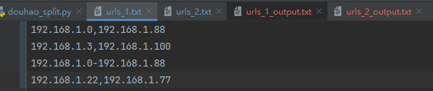
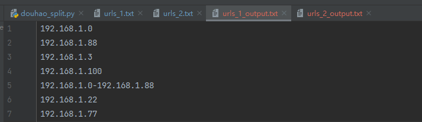
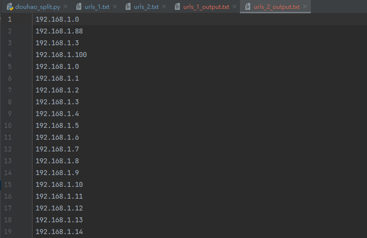
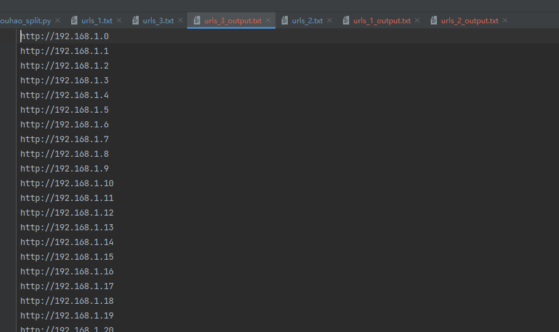

# [KiteCollection](#)
> 该项目主要用于渗透环境中遇到比较杂、多、乱的IP集合整理的py脚本

- 简介: 一款用于整理IP格式的python脚本，目前待完善中...
- 定位：个人维护的渗透测试-KiteCollection
- 更新时间：2021/8/5
- 项目地址：[kitezzzGrim/KiteCollection](#)

---

* 启动 `python3 KiteCollection.py`

**逗号分割**

如192.168.1.0,192.168.1.88

* 操作数字1，放入urls_1.txt如图

* 操作数字1，输出结果至urls_1_output.txt

**横线分割**

如192.168.1.0-192.168.1.88

* 操作数字2，将urls_1_output.txt结果放入urls_2.txt，输出结果至urls_2_output.txt

**添加http头**

如192.168.1.1

* 操作数字3，将目标放入urls_3.txt,输出结果至urls_3_output.txt

